## Writeup

**Advanced Lane Finding Project**

The goals / steps of this project are the following:

* Compute the camera calibration matrix and distortion coefficients given a set of chessboard images.
* Apply a distortion correction to raw images.
* Use color transforms, gradients, etc., to create a thresholded binary image.
* Apply a perspective transform to rectify binary image ("birds-eye view").
* Detect lane pixels and fit to find the lane boundary.
* Determine the curvature of the lane and vehicle position with respect to center.
* Warp the detected lane boundaries back onto the original image.
* Output visual display of the lane boundaries and numerical estimation of lane curvature and vehicle position.

## [Rubric](https://review.udacity.com/#!/rubrics/571/view) Points

### Here I will consider the rubric points individually and describe how I addressed each point in my implementation.  

---

### Writeup / README

All code for this project is in file [pipeline.ipynb](https://github.com/dbjnbnrj/CarND-Advanced-Lane-Lines/blob/master/pipeline.ipynb)

The video is available on [project_video_output.mp4] (https://github.com/dbjnbnrj/CarND-Advanced-Lane-Lines/blob/master/project_video_output.mp4)

### Camera Calibration

#### 1. Briefly state how you computed the camera matrix and distortion coefficients. Provide an example of a distortion corrected calibration image.

#### Ans:

* I used the chessboard images present in camera_cal to obtain an object to image point mapping.

* Object Points correspond to points in the real world and are defined using a (x,y,z) coordinate system. We assumed the chessboard size to 9x6 for the project so we had to create points using a 3D matrix with for 9 rows and 6 columns. For object points we assume that z is 0.

* As we are mapping object points to image points we need to obtain image points from our chessboard images using the `cv2.findChessboardCorners` function.

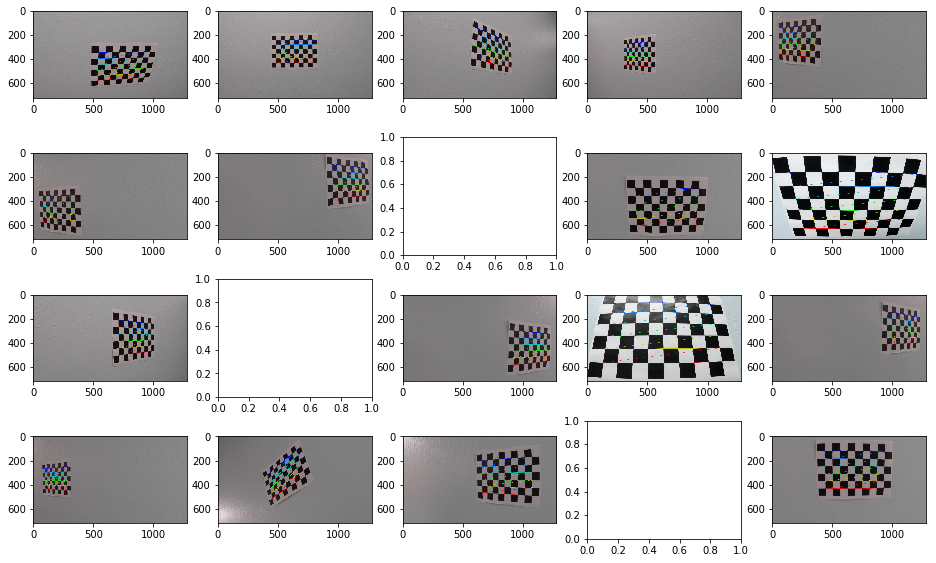

* Finally, I applied this distortion correction to the test image using the `cv2.undistort()` function and obtained this result:

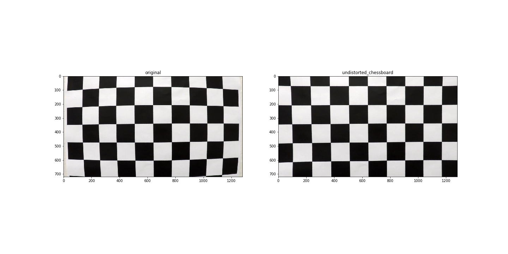

Code Link: The code is in pipeline.ipynb section **Calibration Matrix**

### Pipeline (single images)

#### 1. Provide an example of a distortion-corrected image.

Ans:
To demonstrate this step, I will describe how I apply the distortion correction to one of the test images like this one:

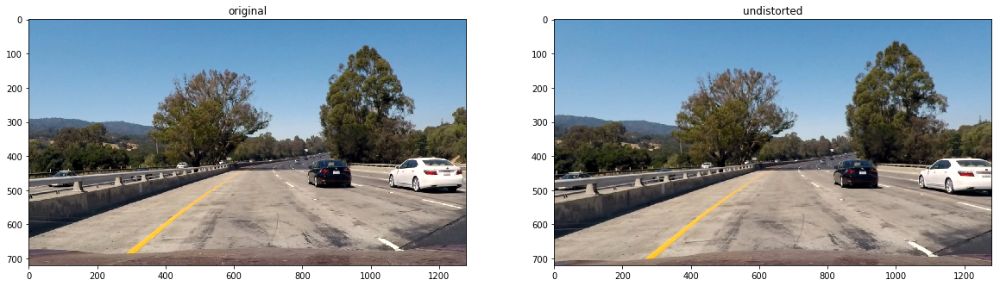

#### 2. Describe how (and identify where in your code) you used color transforms, gradients or other methods to create a thresholded binary image.  Provide an example of a binary image result.

####  Ans:
I experimented with a number of color space and gradient transform techniques to create the threshold binary image. This was one of the most challenging parts of the videos.

####  Playing with Gradients

I used Sobel operators of different kinds with my image and obtained the following results

1.Absolute Sobel operator in X-direction

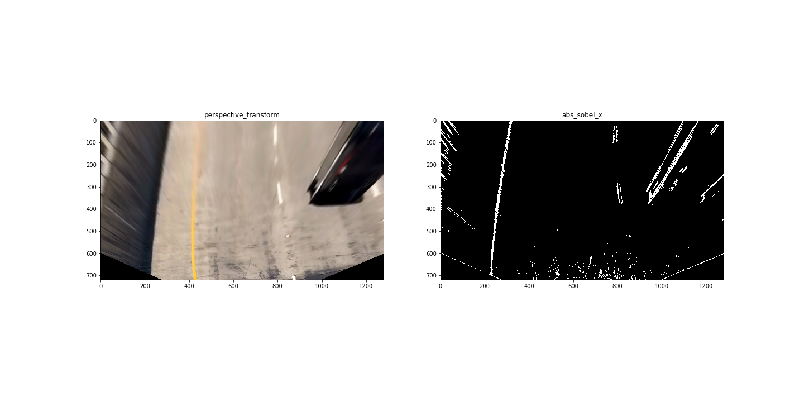

2.Absolute Sobel operator in Y-direction

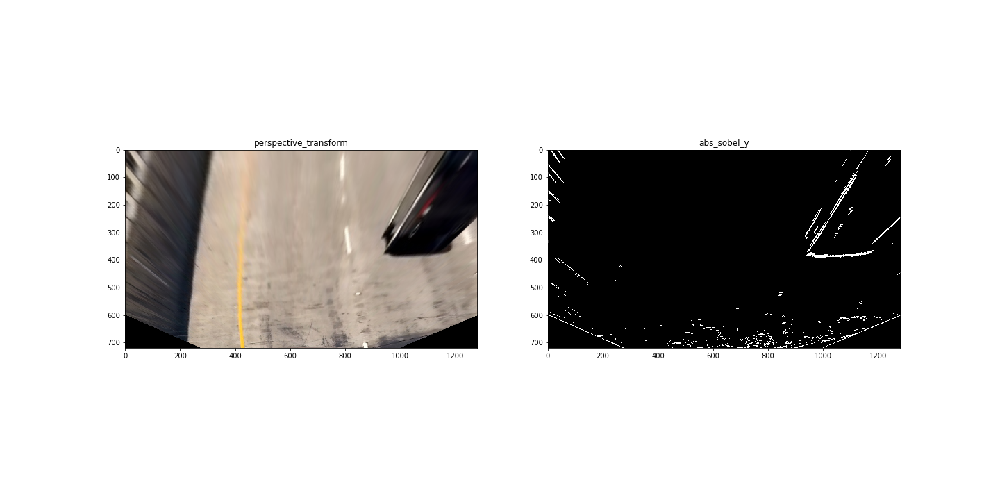

3.Sobel with direction threshold

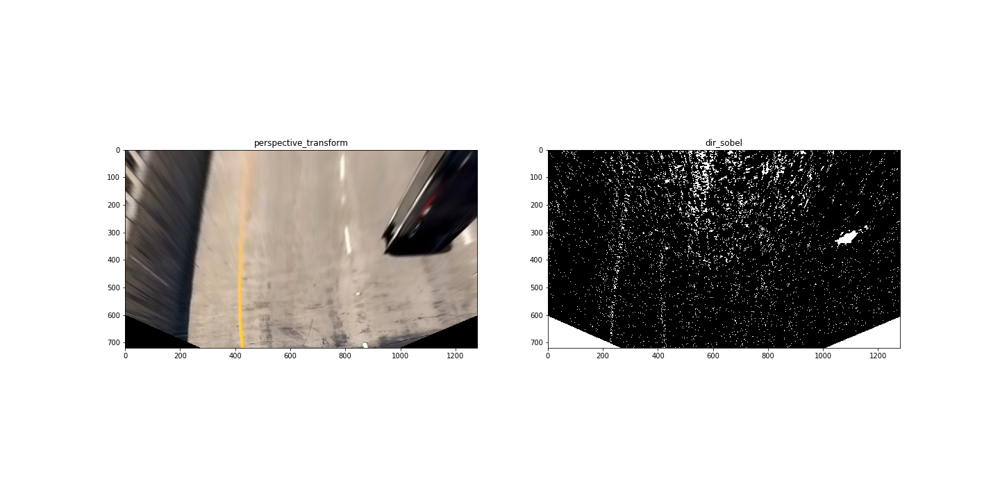

4.Sobel with magnitude threshold

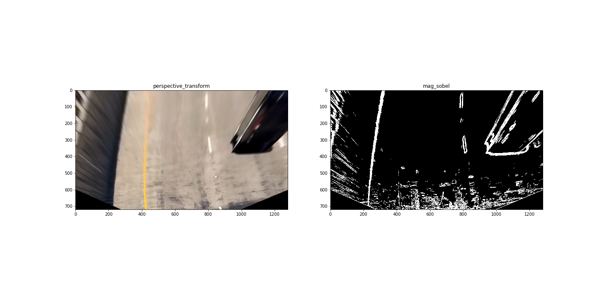

5.Combined Result of Absolute Threshold in X and Direction/Magnitude Threshold

####  Playing with Colorspace

1. RGB Colorspace

**Red Channel**

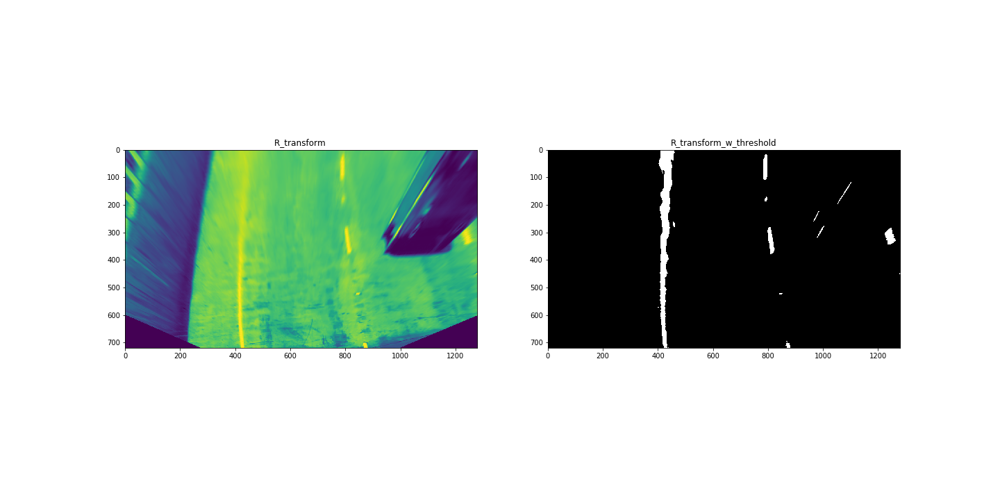

**Blue Channel**

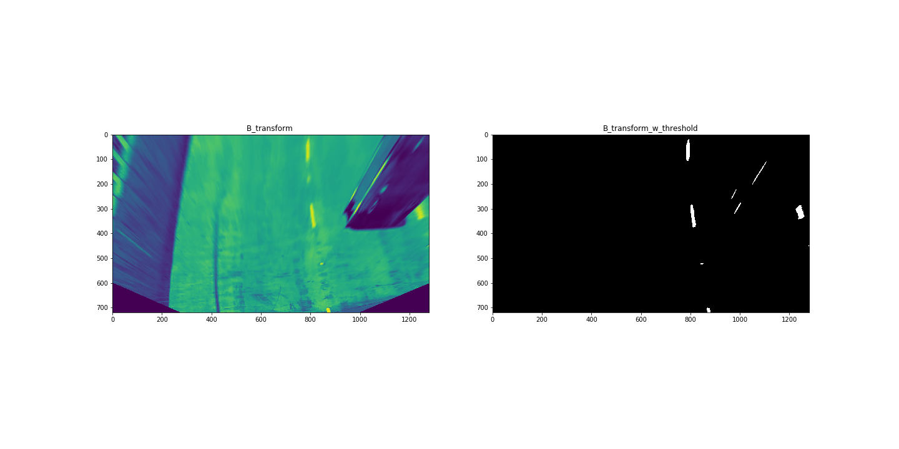

**Green Channel**

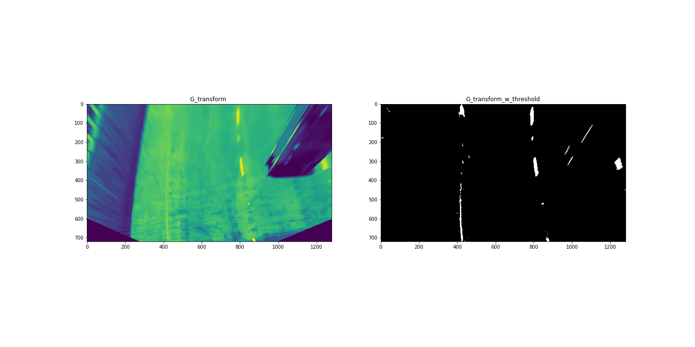

> From this we observe that the Red channel is very good at detecting the yellow lane line

2. HLS Colorspace

a. H Channel

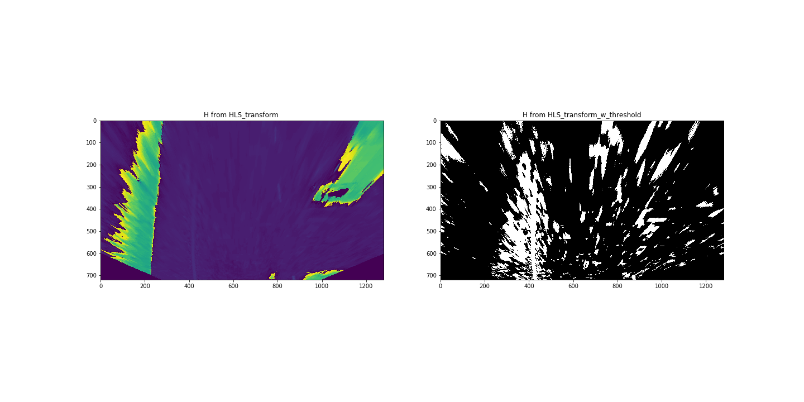

b. L Channel

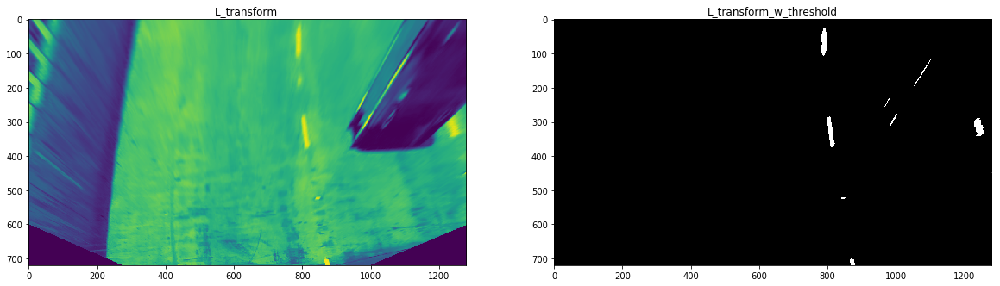

c. S Channel

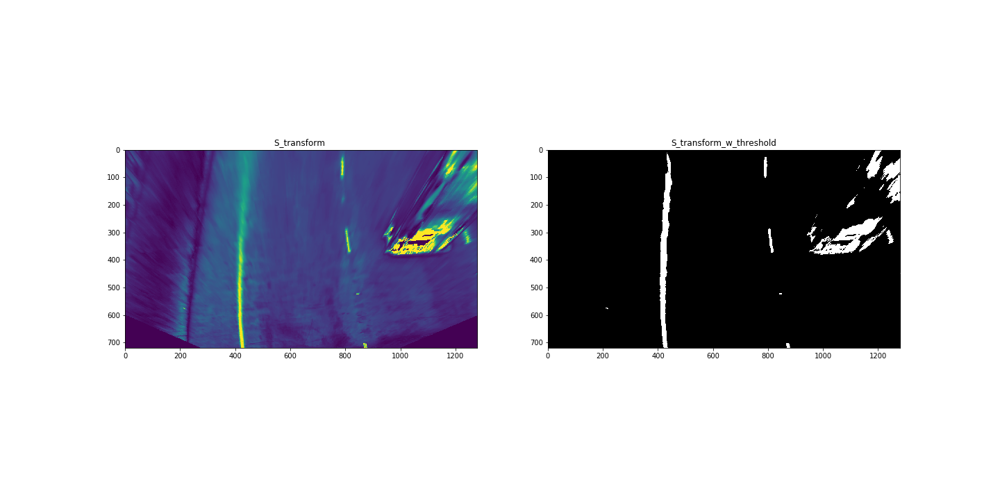

> The S Channel can detect lane lines fairly accurately

3. LAB Colorspace

a. L Channel

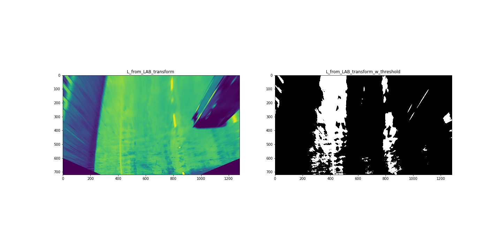

b. A Channel

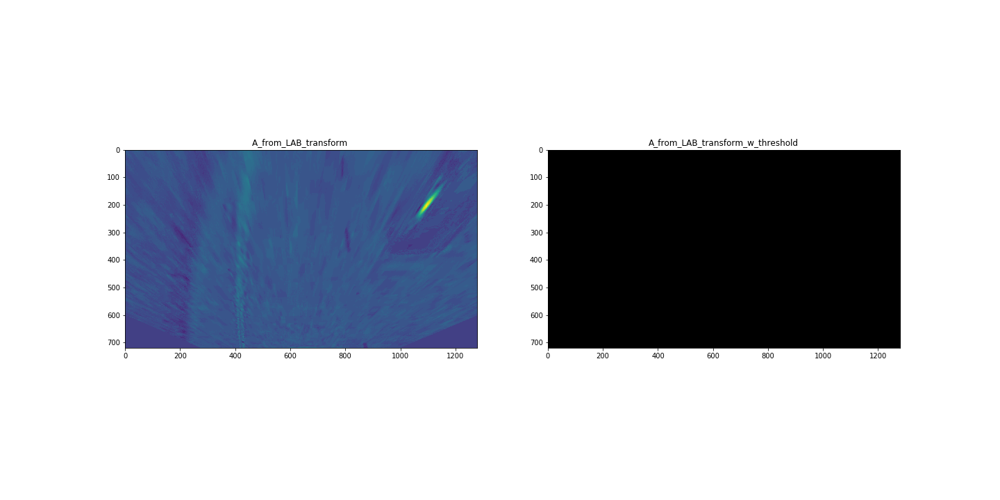

c. B Channel

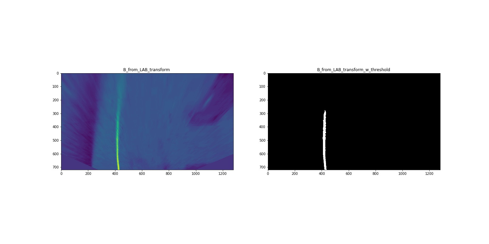

> As we obtained fairly accurate results by isolating the R channel from RGB & S from HLS we use these two color channels to obtain the binary image in our pipeline

#### Final Binary Image

> I obtained the final binary image by applying perspective transform followed by combining the images from the R colorspace of RGB and the S colorspace of HLS.

#### 3. Describe how (and identify where in your code) you performed a perspective transform and provide an example of a transformed image.

####  Ans:
Code for my perspective transform is available in the Perspective Transform section of the ipynb notebook.

I used the function `get_perspective_transform_points` to get the source and destination points for my image.

This resulted in the following source and destination points:
| Source        | Destination   |
|:-------------:|:-------------:|
| 600,450     | 400,0        |
| 750,454      | 900,0      |
| 250,680     | 400, 720      |
| 1100,680     | 960, 720       |

I verified that my perspective transform was working as expected:

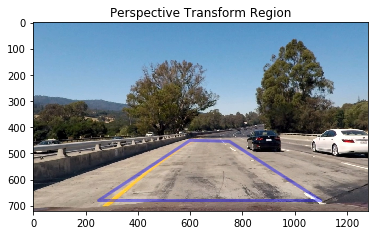

After perspective transform (which is done by function `perspective_transform`) the result is as follows -

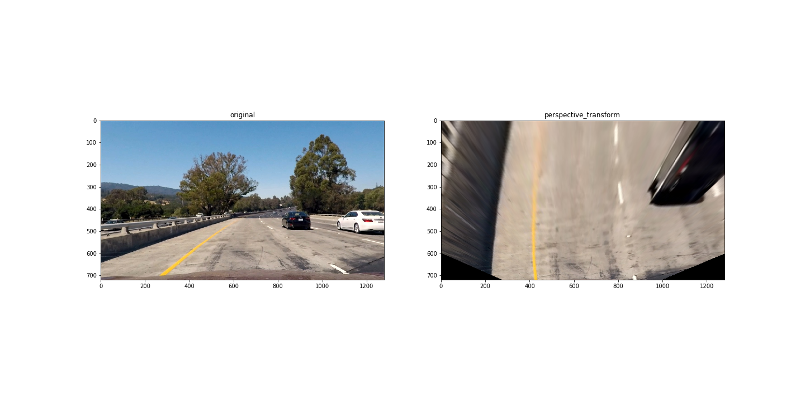

#### 4. Describe how (and identify where in your code) you identified lane-line pixels and fit their positions with a polynomial?

The code for identifying lane line fit is available in the [Calculating Lane Lines](https://github.com/dbjnbnrj/CarND-Advanced-Lane-Lines/blob/master/pipeline.ipynb#Calculating Lane Lines) section of the ipython notebook in the functions `find_lane_lines_with_window` and `find_lane_lines_without_window`.

The result of the two functions is-

1. Find lane lines with window
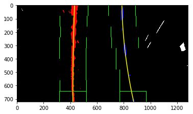

2. Find lane lines without window
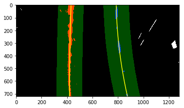

For both these functions I used the example code provided in the course to observe the lane lines and plot windows and polynomial lines.

#### 5. Describe how (and identify where in your code) you calculated the radius of curvature of the lane and the position of the vehicle with respect to center.

The code for calculating Radius of Curvature is in a section of my ipython notebook marked [Radius of Curvature](http://localhost:8888/notebooks/pipeline.ipynb#Radius-of-Curvature). The name of the function that calculates the value is `radius_of_curvature_calculation`. The result of radius of curvature calculation is as follows -

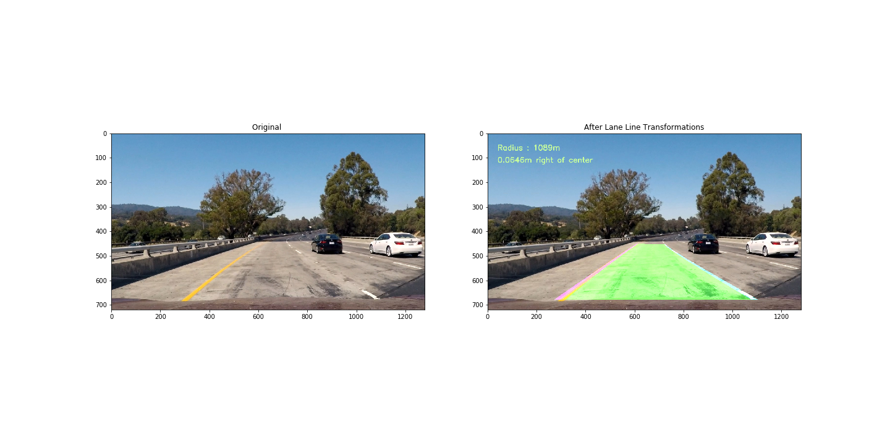

#### 6. Provide an example image of your result plotted back down onto the road such that the lane area is identified clearly.

The `draw_lane` function plots the lane back to the original image.

---

### Pipeline (video)

#### 1. Provide a link to your final video output.  Your pipeline should perform reasonably well on the entire project video (wobbly lines are ok but no catastrophic failures that would cause the car to drive off the road!).

Here's a [link to my video result](./project_video_output.mp4)

---

### Discussion

#### 1. Briefly discuss any problems / issues you faced in your implementation of this project.  Where will your pipeline likely fail?  What could you do to make it more robust?

Core issues I faced involved the following

- Tree shadows:
Getting an accurate binary image using the given colorspace and gradients proved difficult, particularly for road images where shadows were present.

- Handling changing lane curves:
Calculating steep curves is difficult as the radius of curvature is less accurate. Often the video pipeline has to revert back to the previous image and then correct itself for the curved data.
